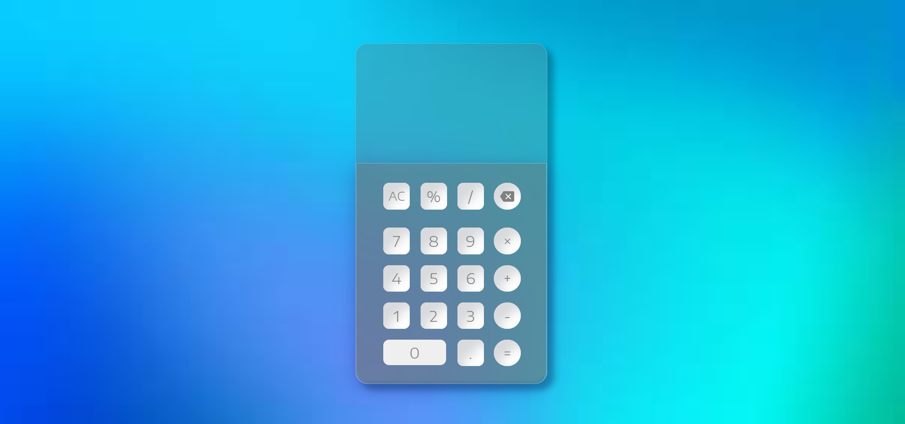

# UI Design Calculator with Neumorphism and Glassmorphism Effect

## Overview

### The challenge

Users should be able to:

- View the optimal layout for the site depending on their device's screen size
- See hover states for all interactive elements on the page

### Links

- Live Site URL: [Click Here to visit the website](https://insurepagewebsite.netlify.app//)

## My process

### Built with

- Semantic HTML5 markup
- CSS custom properties
- Flexbox

### What I learned

I learned how to use flex-box effectively in a website which can make life easy for a developer.

## Author

- Twitter - [@avinash32mittal](https://www.twitter.com/avinash32mittal)
- LinkedIn - [avinash32mittal](https://www.linkedin.com/in/avinash32mittal/)
